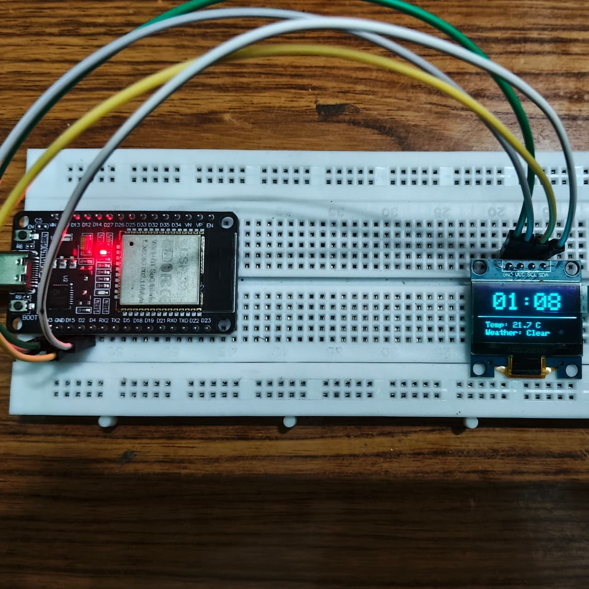
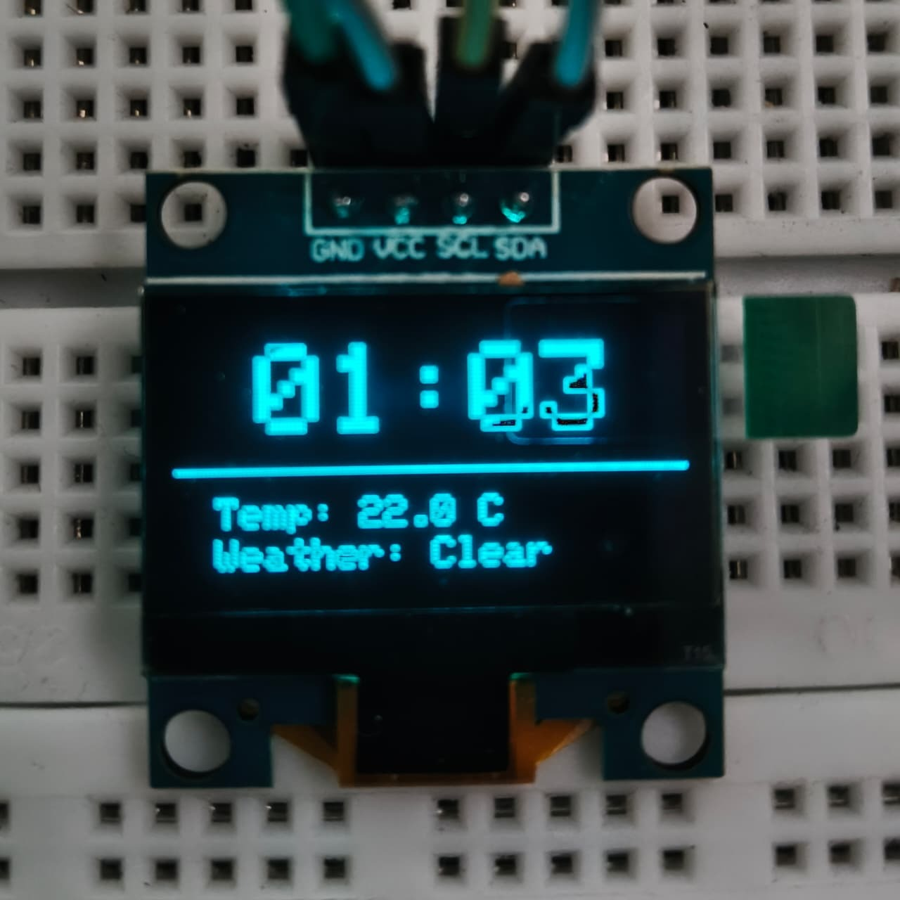

# ESP32 IoT Clock + Weather Display

A minimal ESP32 IoT project that connects to WiFi, synchronizes time using NTP, fetches weather data from the OpenWeather API, and displays the information on an OLED screen.

This repository focuses on a **clean reproducible baseline** before expanding the system into a larger IoT desk companion device.

---

## Features

* WiFi connection using ESP32
* Automatic time synchronization via NTP
* Weather data retrieval using OpenWeather API
* Combined **time + weather display** on OLED (SSD1306 128x64)

---

## Hardware

* ESP32 DevKit
* SSD1306 OLED Display (I2C)

---

## Hardware Setup

Breadboard assembly and wiring of the ESP32 with the OLED display.


<br>


---

## Device Boot + Live Display

During startup the device:

1. boots
2. connects to WiFi
3. synchronizes time via NTP
4. fetches weather data

Then the OLED displays **time and weather together**.


---

## Main Display

Example of the final screen showing:

* current time
* temperature
* weather condition



---

## Folder Structure

```
esp32-iot-clock-weather
│
├── firmware
│   └── main
│       └── esp32_clock_weather.ino
│
├── docs
│   ├── setup.md
│   └── architecture.md
│
├── hardware
│   └── components.md
│
└── media
```

---

## Setup

Follow the setup instructions in:

```
docs/setup.md
```

---

## Configuration

Before uploading the firmware, update the following fields inside the code:

```
const char* ssid     = "YOUR_WIFI_NAME";
const char* password = "YOUR_WIFI_PASSWORD";

String apiKey        = "YOUR_OPENWEATHER_API_KEY";
```

You can obtain a free API key from:

https://openweathermap.org/api

---

## Future Improvements

Planned expansions:

* sensor integration
* OLED animations
* emotion-based display
* ESP32-CAM visual input
* IoT dashboard
